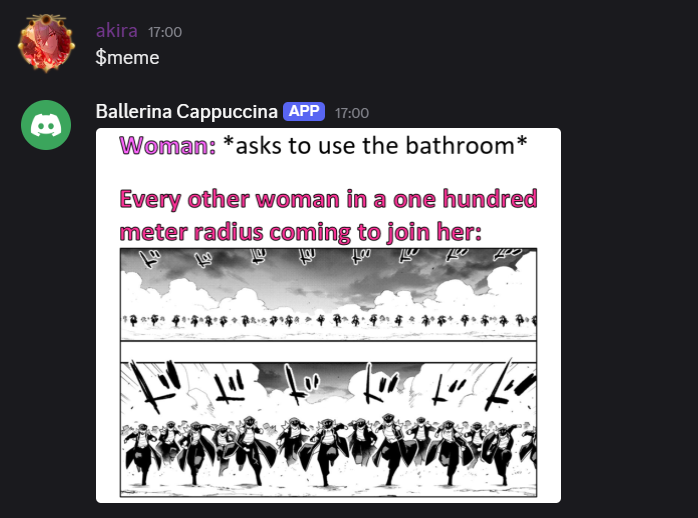

🤖 Discord Meme Bot

A simple and fun Discord bot built with Python that sends random memes from Reddit using the Meme API. Just type $meme and enjoy a fresh meme in your server!

-------

📸 Preview

When a user types: $meme

The bot replies with a random meme from Reddit.

-------

🚀 Features

- Sends memes with the $meme command

- Uses the Meme API to fetch real-time meme content

- Responds only in the channel it's permitted to (e.g., #memes)

-------

📦 Requirements

- Python 3.10+

- discord.py

- requests

-------

🔐 Setup

1. Clone the repo: git clone https://github.com/rajaashb/Discord-Meme-Bot.git

2. cd project_directory

3. Create a .env file: DISCORD_TOKEN = your_bot_token_here

4. Run your bot: python bot.py

-------

📁 File Structure

.

├── bot.py

├── .env

├── .gitignore

└── README.md

-------

🛡️ Safety Notes

Make sure your .env file is listed in .gitignore to avoid exposing your bot token publicly.
